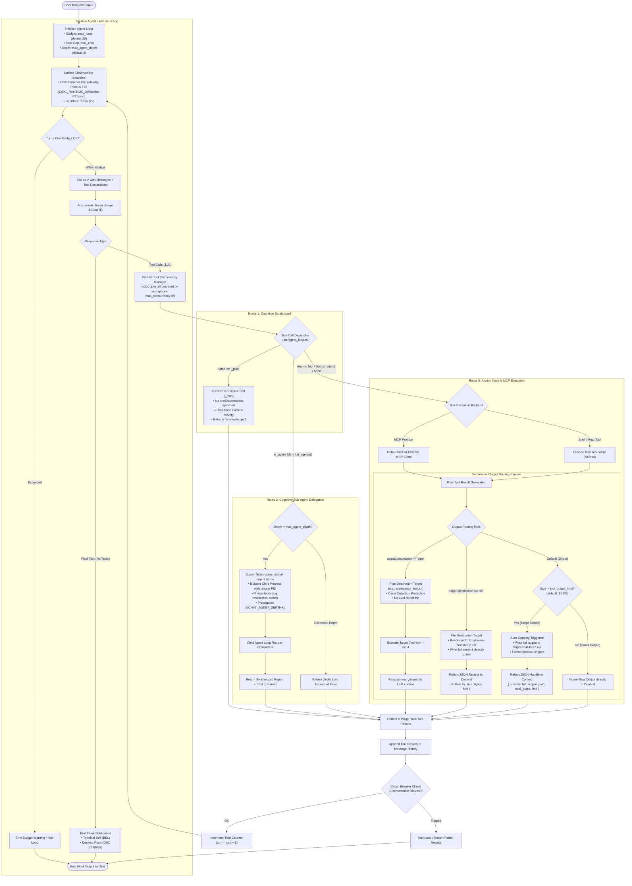

# Agent Architecture: Tools, Deterministic SH Agents, and Cognitive Sub-Agents

This document details the architectural design, dispatch mechanics, and composition patterns of tools and agents within `aichat` and `llm-functions`.

---

## 1. Architectural Taxonomy

```mermaid
graph TD
    subgraph Route 3: Deterministic Tool / SH Agent [Fast & Pure Bash Execution]
        T_Call[LLM Tool Call: fs_cat / add_todo] --> T_Bin[bin/fs_cat or bin/todo]
        T_Bin --> T_Script[tools/fs_cat.sh or agents/todo/tools.sh]
        T_Script --> T_Ret[Executes locally in ~0.05s and returns output]
    end

    subgraph Route 2: Cognitive Sub-Agent [Autonomous Multi-Turn Subprocess]
        A_Call[LLM Tool Call: researcher] --> A_Fork[Spawns aichat --agent researcher]
        A_Fork --> A_Proc[Dedicated Child Process: Unique PID]
        A_Proc --> A_Loop[Multi-turn loop with private tools & constraints]
        A_Loop --> A_Ret[Returns synthesized report to caller]
    end
```



| Type | Examples | Process Model | Execution | Role in Ecosystem |
| :--- | :--- | :--- | :--- | :--- |
| **Atomic Tool** | `fs_cat`, `web_search`, `read_pdf` | Same process / subshell | **Single invocation (0 turns):** Runs script in milliseconds. | Passive actuator / capability. |
| **Deterministic SH Agent** | `todo`, `sql`, `coder` | Executed via bash shim | **Single invocation (0 turns):** Dispatches subcommands (`todo add_todo`). | Multi-tool CLI bundle. |
| **Cognitive Sub-Agent** | `orchestrator`, `researcher` | Dedicated child process | **Multi-turn loop (1–20 turns):** Autonomous LLM reasoning loop with unique PID. | Active reasoner / specialist. |

---

## 2. Dispatch Mechanics in the Agent Loop

When an LLM emits a tool call, `aichat` evaluates the call through a 3-route dispatcher in `src/agent_loop.rs`:

```rust
// Dispatch Logic in src/agent_loop.rs
if call.name == "_plan" {
    // Route 1: In-process Cognitive Scratchpad
    // Emits trace event, does not execute shell command, returns "acknowledged".
} else if func.is_agent && crate::config::list_agents().contains(&call.name) {
    // Route 2: Cognitive Sub-Agent Delegation
    // Spawns child process: `aichat --agent <name> "<prompt>"` with unique PID.
} else {
    // Route 3: Deterministic Shell Execution
    // Resolves binary via PATH (`llm-functions/bin/<name>`) and runs locally.
}
```

### Why the `list_agents()` check is essential
Upstream `aichat` tags individual tool subcommands (like `add_todo`) with `"agent": true` in `functions.json` to route them via the `bin/todo` binary wrapper. By verifying `list_agents().contains(&call.name)`, `aichat` differentiates between:
1. **Subcommand dispatch** (running `bin/todo add_todo` via Route 3).
2. **Sub-agent delegation** (spawning an autonomous `aichat --agent researcher` child process via Route 2).

---

## 3. The Role of `_plan` (In-Process Pseudo-Tool)

`_plan` is a built-in cognitive scratchpad automatically injected into the agent loop:
* **Function Signature:** `_plan(thought: string)`
* **Execution:** Intercepted in-process by the Rust runtime. No shell processes are spawned.
* **Observability:** Emits an `AgentLoopEvent::PlanReceived` event that prints live to the terminal trace (`/dev/tty`) and updates tmux window titles.
* **Context Retention:** Kept in intermediate turn history for subsequent steps, but completely omitted from final user-facing text responses.

---

## 4. Configuration & Source of Truth in `llm-functions`

The system maintains a pure, simple `argc` Bash architecture:

1. **For Tools (`tools/*.sh`):**
   * Write bash script with `# @describe` and `# @option` argc comments.
   * Add to `tools.txt`.
   * `argc build` compiles them to `functions.json` and creates `bin/<tool>` symlinks.
2. **For Deterministic SH Agents (`agents/<name>/tools.sh`):**
   * Define subcommands in `agents/<name>/tools.sh`.
   * `argc build` compiles subcommands to `agents/<name>/functions.json` and creates `bin/<agent>`.
3. **For Cognitive Sub-Agents (`agents/<name>/`):**
   * Persona and constraints defined in `agents/<name>/index.yaml`.
   * Allowed tools listed in `agents/<name>/tools.txt`.
   * `argc build` dynamically compiles `agents/<name>/functions.json`.

---

## 5. Full Agent Operation Loop & Output Routing Pipeline

Below is the complete execution loop spanning turn budgets, observability hooks, parallel tool dispatch, declarative output routing, and cognitive sub-agent subprocess delegation.

*(The standalone diagram definition is also maintained at [agent-loop-operation.mmd](file:///home/istari/projects/perry/.kiro/docs/agent-loop-operation.mmd))*



