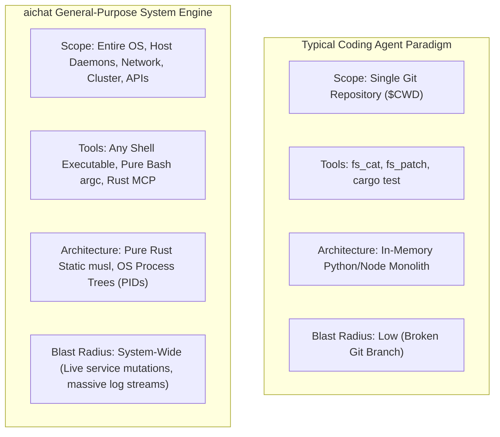
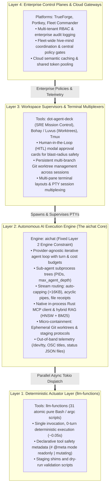
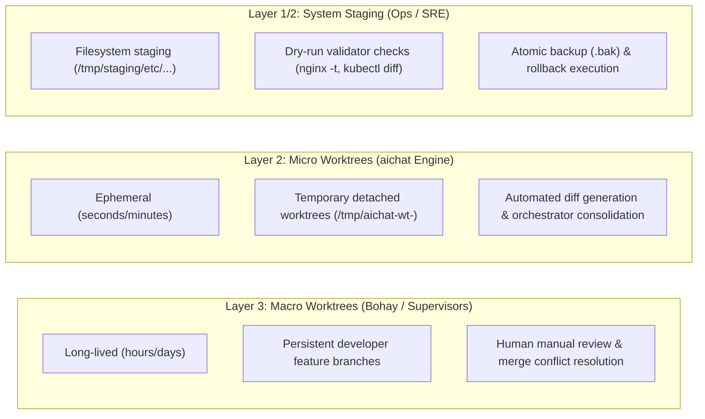

# Architectural Blueprint & Roadmap: The `aichat` System-Level Autonomous Engine

> **Archived source document.** Authored by a prior agent during the Session-2 period
> (2026-08-28 → 2026-09-02). Preserved verbatim as the origin of the 4-Layer Taxonomy,
> the SRE stress-test rationale, and the backlog #5-#10 specs. For current status and the
> roadmap↔backlog crosswalk see [`roadmap.md`](roadmap.md); some figures here are
> superseded (notably the 72.9% coverage baseline — re-measured in Session 3, see
> [`coverage-remeasurement-2026-09-02.md`](coverage-remeasurement-2026-09-02.md)).

**Context Document for Cross-Agent Handoff & Architecture Guidance**  
**Session Timestamps:** 2026-08-28T16:47:33-04:00 to 2026-09-02T16:35:26-04:00  
**Target Repositories:** `~/projects/aichat` (Engine) & `~/projects/llm-functions` (Actuators)  

---

## 1. Executive Thesis: The Philosophy & Scope of `aichat`

### The "Coding Agent Trap" vs. System-Wide Autonomy
The mainstream AI agent landscape (represented by tools like Claude Code, Cursor, Devin, and AutoGen) is almost universally built around a narrow set of assumptions:
1. **Confined Blast Radius:** All agent actions are strictly scoped to a single local Git repository directory (`$CWD`).
2. **Homogeneous Actuators:** The toolset is virtually limited to reading files, applying diff patches (`fs_patch`), and running language compilers (`cargo test`, `npm run`).
3. **Low-Consequence Failure:** Breaking code in a git branch causes zero live operational damage—a simple `git checkout .` resets the world.

Because of these assumptions, the industry built **in-memory actor monoliths in Python/TypeScript** that manage multi-agent communication inside shared runtime memory graphs.

### `aichat`'s True Identity
`aichat` rejects this narrow framing. **`aichat` is a General-Purpose, Unix-Native AI Execution Engine operating with system-level breadth.** 

It is designed to interact with the **entire operating environment**:
* Local and remote filesystems (`/etc`, `/var/log`, `/tmp`)
* Systemd service managers and daemon lifecycles
* Kernel parameters (`sysctl`) and firewall tables (`iptables`, `nftables`)
* Network stacks, diagnostic probes (`ss`, `tcpdump`, `ping`, `curl`)
* Container runtimes (Docker, Podman) and Kubernetes clusters (`kubectl`, `helm`)
* Cloud infrastructure APIs, databases (`sql`), and code repositories

---

## 2. The SRE / Systems Administration Stress-Test

The operational reality of **Site Reliability Engineering (SRE), DevOps, and Systems Administration** serves as the defining architectural stress-test and justification for *why* `aichat` is designed the way it is:

1. **Why OS Process Isolation (PIDs) Instead of In-Memory Threads?**  
   When sub-agents have shell execution powers, running them in shared in-memory threads creates catastrophic cascade risk. In `aichat`, every delegated sub-agent (`orchestrator` $\rightarrow$ `researcher`) is a separate OS process with a dedicated PID, independent memory space, turn budget, and cost ceiling. If a sub-agent crashes or hangs, the parent orchestrator isolates the failure gracefully.
2. **Why Declarative Stream Routing & Auto-Capping?**  
   System commands produce massive, unconstrained text streams (e.g., 500 KB `journalctl` dumps, network packet traces). Traditional agents dump these directly into the LLM prompt, overflowing context windows. `aichat` intercepts outputs in Rust, auto-caps anything over 16 KB to a temporary file handle with a preview, and allows direct tool-to-tool piping (`curl` $\rightarrow$ `summarize_text`) without burning LLM context tokens.
3. **Why "Triage in Parallel, Actuate in Sequence"?**  
   During an outage, an orchestrator can spawn 5 read-only diagnostic sub-agents (`journalctl`, `kubectl get`, `dmesg`, `netstat`, `ping`) simultaneously. Because read operations are collision-free, parallel Tokio execution delivers massive speedups. However, state-mutating actions (`systemctl restart`, `kubectl apply`) must be staged, validated, and executed in sequence.
4. **Why Zero-Dependency Static `musl` Binaries?**  
   Infrastructure triage happens on air-gapped VPC jump hosts, stripped-down production bastions, and minimal container appliances with 64 MB of RAM. `aichat` compiles to a single static `musl` binary (~14 MB) that requires zero Python, Node.js, or modern `glibc` dependencies.
5. **Why Pipe-Proof `/dev/tty` Observability?**  
   System administrators pipe commands (`aichat ... | jq` or `aichat ... > incident-report.md`). Standard stdout logging breaks pipelines. `aichat` routes live traces and OSC terminal titles out-of-band via `/dev/tty`, keeping pipelines clean while maintaining full visibility.

---

## 3. The 4-Layer Operational Taxonomy

To maintain architectural purity and avoid the "framework bloat" that plagues modern AI libraries, we formalize a strict **4-Layer Separation of Concerns**:

### The Layer Boundaries Explained:
* **Layer 1 (`llm-functions`):** The hands and feet. Simple, fast Bash scripts. Zero cognitive overhead.
* **Layer 2 (`aichat`):** The brain and process harness. The core execution engine that reasons, dispatches, budgets, and isolates.
* **Layer 3 (Supervisors):** The human cockpit. Renders visual cards, manages terminal panes, and manages long-lived developer worktrees.
* **Layer 4 (Gateways):** The organizational policy layer. Audits access, manages quotas, and coordinates multi-node fleets.

---

## 4. The Containment Spectrum: Micro vs. Macro Worktrees

In a system-level engine, containment exists on a spectrum across layers:

1. **For System & Configuration Mutations:**  
   The **Staging & Dry-Run Protocol**. Sub-agents write proposed configurations to `/tmp/staging/` and run syntax validators (`nginx -t -c ...`, `caddy validate`, `terraform plan`). The parent orchestrator reviews the validated plan and applies it atomically with automatic backup copies (`.bak`).
2. **For Code & Repository Modifications:**  
   The **Ephemeral Git Worktree Pattern**. Leaning on standard Unix `git worktree`, `aichat` provisions temporary detached worktrees (`git worktree add --detach /tmp/aichat-wt-<pid> HEAD`). Child `coder` agents build and test in complete isolation, returning unified diffs for the parent orchestrator to merge.
3. **For System Diagnostics:**  
   **Parallel Read-Only Swarms**. Diagnostic probes are inherently collision-free and run concurrently across the live system.

---

## 5. The Layer 2 Engine Roadmap: Direction & Implementation Specs

By applying our 4-layer separation of concerns, we crystallized **six high-leverage architectural capabilities** for the `aichat` engine backlog:

### Backlog #6: Declarative Tool Safety Modes (`# @meta mode`)
* **Priority:** High | **Scope:** ~150–250 lines (`src/function.rs`, `src/agent_loop.rs`, `llm-functions/Argcfile.sh`)
* **Problem:** Sub-agents spawned during a parallel triage sweep might accidentally call a mutating tool (e.g., restarting a service or deleting a database record) before root cause is determined.
* **Architecture:**
  1. Tools declare safety metadata: `# @meta mode readonly` vs. `# @meta mode mutating`.
  2. `FunctionDeclaration` parses the `mode` field.
  3. When the `orchestrator` spawns child sub-agents, they inherit a `readonly` capability mask by default.
  4. Only the root `orchestrator` holds mutating execution privileges, guaranteeing controlled, sequential actuation.

---

### Backlog #7: Session Resumption & Write-Ahead Log (WAL) Journaling (`--resume`)
* **Priority:** High | **Scope:** ~250–350 lines (`src/agent_loop.rs`, `src/cli.rs`, new `src/session_wal.rs`)
* **Problem:** Real-world system investigations often take 10–15 turns. If interrupted by network drops, rate limits, or user aborts (`SIGINT`), all intermediate diagnostic probe results are lost.
* **Architecture:**
  1. `agent_loop.rs` streams every turn event (`TurnStart`, `ToolCall`, `ToolResult`, `Plan`) to an append-only JSON-L journal at `$XDG_RUNTIME_DIR/aichat-<session-id>.wal`.
  2. Add `aichat --resume <session-id>` to reconstruct conversation context and completed tool artifacts from the WAL file and resume execution at turn $N$.

---

### Backlog #8: Dynamic Multi-Turn Context Compaction
* **Priority:** Medium | **Scope:** ~200–300 lines (`src/agent_loop.rs`, `src/config/mod.rs`)
* **Problem:** Extended 15+ turn troubleshooting sessions accumulate large message arrays that consume excessive tokens, increase latency, and degrade LLM reasoning.
* **Architecture:**
  1. Track active prompt tokens at the start of each turn.
  2. When token volume exceeds a configurable threshold (e.g., $70\%$ of the model's context window), trigger rolling compaction.
  3. Automatically micro-summarize turns $1 \dots (N-3)$ into a dense, structured system state block (current hypothesis, verified facts, failed attempts), while preserving the 3 most recent turns in full raw fidelity.

---

### Backlog #9: Ephemeral Git Worktree Micro-Sandboxes for Multi-Agent Coders
* **Priority:** Medium | **Scope:** ~150–250 lines (`src/agent_loop.rs`, `src/function.rs`)
* **Problem:** If an orchestrator delegates to two parallel `coder` agents in the same repository, they will overwrite each other's files and corrupt compilation builds (`cargo build`).
* **Architecture:**
  1. When delegating to parallel sub-agents in a Git repo, `aichat` executes `git worktree add --detach /tmp/aichat-wt-<pid> HEAD`.
  2. The child sub-agent is spawned with its current working directory set to `/tmp/aichat-wt-<pid>`.
  3. The child agent edits and tests in isolation, returning a clean unified diff/patch.
  4. The parent orchestrator applies the patch to the main repository and runs `git worktree remove --force /tmp/aichat-wt-<pid>`.

---

### Backlog #10: Staged Configuration & Dry-Run Protocol for System Operations
* **Priority:** Medium | **Scope:** Prompt contracts & tool shims (`llm-functions`, `agents/orchestrator/index.yaml`)
* **Problem:** Host configuration mutations (e.g., modifying Caddyfiles, firewall rules, or Kubernetes manifests) require pre-flight syntax validation and rollback safety before live activation.
* **Architecture:**
  1. Mutation tools in `llm-functions` target `/tmp/staging/` paths.
  2. Tools run paired validators (`nginx -t -c ...`, `caddy validate`, `kubectl diff`, `terraform plan`).
  3. The orchestrator reviews the validator output, takes an atomic backup (`.bak` or `etckeeper` snapshot), and copies the staged config to the live destination.

---

### Backlog #5: Test Suite Expansion & Code Coverage Hardening
* **Priority:** Medium | **Scope:** ~200–400 lines (`src/agent_loop.rs`, `src/function.rs`, `src/mcp.rs`)
* **Context:** Our dynamic LLM profiling demonstrated a solid **72.90% line / 79.41% function coverage** baseline across `src/agent_loop.rs`.
* **Architecture:** Add targeted unit tests for cyclic pipe aborts, sub-agent crash isolation, exact auto-cap byte boundaries, and mid-turn budget cap exhaustion.

---

## 6. Summary for Future Agents

When continuing development on this codebase, always remember:
1. **Do not turn `aichat` into a bloated coding IDE or cloud gateway.** Keep Layer 2 focused on being a fast, static-binary execution engine.
2. **Lean on native Unix primitives:** Use OS processes, PIDs, standard pipes, `/dev/tty`, and `git worktree` rather than building heavyweight custom frameworks.
3. **Preserve the SRE operational baseline:** Ensure all changes respect process isolation, context hygiene via stream routing, and safe actuation boundaries.
