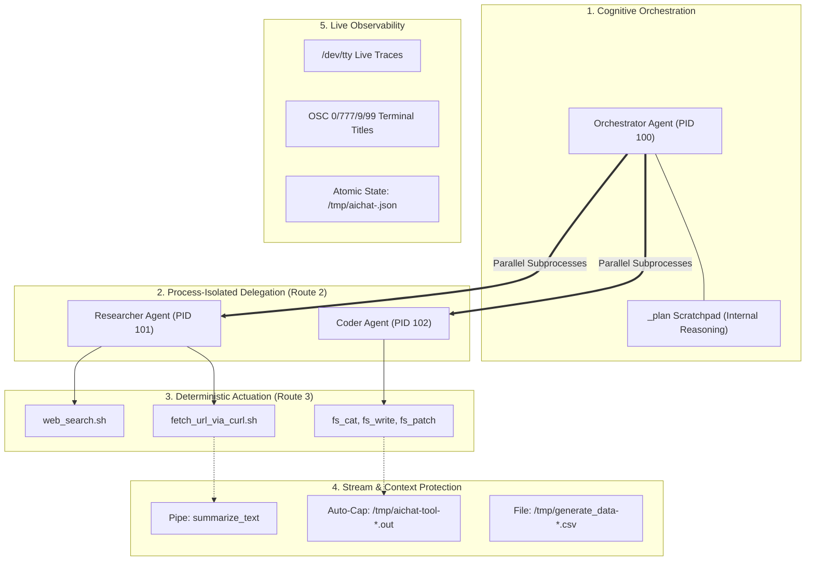

# The Philosophy & Architecture of the `aichat` Enhanced Fork

---

## 1. Executive Vision: The Unix Philosophy for Autonomous AI

Modern AI frameworks (such as LangChain, AutoGen, CrewAI) often suffer from heavyweight abstractions, complex Python runtime dependencies, opaque execution states, and monolithic context bloat.

This fork takes a fundamentally different path. It applies the **timeless principles of Unix design** to modern LLM agent orchestration:

> **1. Write programs that do one thing and do it well.** (Atomic tools in `llm-functions`)  
> **2. Write programs to work together.** (Hierarchical sub-agent delegation)  
> **3. Write programs to handle text streams, because that is a universal interface.** (Declarative output routing, pipes, and files)  
> **4. Treat everything as an isolated process with clear boundaries.** (Dedicated child `aichat` subprocesses with unique PIDs)

### System-Wide Scope vs. The "Coding Agent Worktree" Trap

A central architectural distinction of `aichat` is that **it is not a typical coding agent confined to a single Git repository or worktree**.

Typical coding agents (Claude Code, Devin, Cursor) operate under narrow assumptions: all actions are scoped to a single workspace directory (`$CWD`), tools are mostly file patchers/compilers, and the blast radius is low (a broken git branch). Consequently, they rely on in-memory object graphs.

**`aichat` is a general-purpose, Unix-native AI execution engine with system-level scope.** It interacts with the entire OS, host filesystems, network interfaces, systemd daemons, logs, Kubernetes clusters, and cloud APIs. 

The **SRE / Systems Administration use case** serves as the defining operational stress-test for this architecture:
* When an agent operates across real infrastructure, sub-agents cannot be in-memory threads—they must be **process-isolated OS subprocesses (PIDs)**.
* Tools cannot dump 500KB log files into context—they require **stream routing, auto-capping, and piping**.
* Actuation cannot be reckless—it demands **parallel read-only diagnostic swarms and controlled, sequential state mutations**.
* Deployment cannot require gigabytes of Python/Node runtimes—it requires **zero-dependency static musl binaries** that run on minimal VPC jump-boxes and legacy bastions.

---

## 2. Core Pillars of the Architecture

---

### Pillar 1: Hierarchical Delegation over Context Monoliths
* **The Problem:** Giving a single LLM 50 tools and asking it to do research, write code, and verify facts in one continuous thread inevitably leads to context contamination, high token costs, and reasoning degradation.
* **The Fork's Solution:** **Agents as Tools.**
  * The top-level **`orchestrator`** acts as a project manager. It does not touch raw files or read hundreds of web pages. It uses `_plan` to break down instructions and delegates to specialist sub-agents.
  * The **`researcher`** sub-agent runs in its own isolated `aichat` subprocess, uses its private web tools, iterates across multiple turns, and returns **only** a clean, synthesized summary to the orchestrator.
  * **Result:** Pristine context hygiene, minimal token consumption, and specialized prompt constraints per task.

---

### Pillar 2: Process Isolation & Native Concurrency
* Every delegated sub-agent runs as an independent OS process with a **unique PID**.
* Multiple sub-agents (e.g. researching Rust vs. Python runtimes in parallel) execute concurrently using Tokio async tasks.
* If a sub-agent crashes, exhausts its turn budget, or gets terminated, it does not corrupt the parent orchestrator's state.

---

### Pillar 3: Declarative Data Flow (Pipes, Files, and Auto-Capping)
* In traditional function calling, tools return raw strings into the prompt. If a tool outputs a 500KB dump, the context window overflows.
* The fork introduces **Unix-style stream routing** configured directly via companion JSONs:
  * **Auto-Capping:** Returns over 100KB are automatically offloaded to `/tmp/aichat-tool-*.out`, giving the LLM a clean preview and a path.
  * **Piping (`"destination": "pipe"`):** The output of `fetch_url_via_curl` is piped automatically into `summarize_text` before reaching the LLM.
  * **File Targets (`"destination": "file"`):** Generated mock data is written directly to disk without bloating prompt tokens.

---

### Pillar 4: Real-Time Observability without Breaking Pipelines
* A major challenge with CLI tools is that redirecting or piping stdout normally silences progress spinners and diagnostics.
* The fork solves this elegantly:
  1. **Direct `/dev/tty` Streaming:** Live turn events (`calling:`, `completed`, `plan:`) stream directly to the terminal screen, remaining visible even inside complex Nushell/bash pipelines.
  2. **Terminal Escapes (OSC Titles & Bells):** Sends dynamic status updates to tmux window titles (`turn 1/20 | web_search | researcher:589663 (4s $0.0036)`).
  3. **Atomic JSON Status Files:** Periodically writes `/tmp/aichat-<pid>.json` so external monitors, dashboards, or scripts can poll agent health and token spend.

---

### Pillar 5: Deterministic Safety & Financial Ceilings
* Autonomous multi-agent loops can accidentally enter infinite loops or run up large API bills.
* The fork embeds strict safeguards:
  * **Turn Budgets (`MAX_TURNS`):** Hard limit on loop iterations per process.
  * **Financial Circuit Breakers (`MAX_COST_USD`):** Automatically halts the loop if accumulated costs exceed a specified budget.
  * **Tool Circuit Breakers:** Disables individual tools if they repeatedly fail, preventing thrashing.

---

### Pillar 6: Universal Portability & Deep Legacy Support
* **The Antipattern:** Heavy modern AI frameworks require gigabytes of dependencies, recent Python/Node runtimes, modern `glibc` versions, and multi-gigabyte Docker engines, completely excluding legacy servers, edge appliances, and minimal environments.
* **The Fork's Solution:** **True Ubiquity & Zero-Dependency Execution.**
  * **Static Musl Binaries:** By compiling via Rust's `musl` targets, the `aichat` engine eliminates `glibc` coupling, allowing it to run on Linux kernels dating back to **2.6.32 / 3.2** (e.g. CentOS 6/7, Debian 7/8, Ubuntu 12.04+, Alpine Linux, and BusyBox/OpenWrt routers).
  * **Minimal Hardware Footprint:** Runs comfortably in as little as **64 MB – 128 MB RAM** and under **25 MB disk space**.
  * **Ubiquitous Tooling Baseline:** Relies strictly on standard **Bash $\ge$ 4.0** (released in 2009), `curl`, and `jq`—utilities present out-of-the-box on virtually every Unix system for the last 15 years.

---

## 3. The Vital Role of `llm-functions`

`llm-functions` is the **complementary heart** of this ecosystem:

1. **Pure Bash / `argc` Simplicity:**  
   Writing a new tool or agent does not require learning a complex framework SDK. A developer simply writes a readable 10-line Bash script with `# @describe` and `# @option` doc-comments.
2. **Deterministic Workers vs. Cognitive Agents:**
   * Deterministic tasks (file operations, SQL queries, todo management) remain lightweight, fast bash scripts that execute in ~0.05s without LLM overhead (**Route 3**).
   * Cognitive tasks (`researcher`, `orchestrator`) are defined as prompts and toolsets that `aichat` executes as full reasoning loops (**Route 2**).
3. **Single Source of Truth:**  
   Running `argc build` compiles the human-readable bash scripts into standard JSON Schemas, creates executable symlinks in `bin/`, and prepares the environment for `aichat` dynamically.

---

## 4. Summary

This fork elevates `aichat` from a simple interactive chat CLI into a **lightweight, blazing-fast, process-isolated multi-agent operating environment**:

* **Fast and Resource-Efficient:** Written in pure Rust with minimal footprint (~14 MB total).
* **Deep Legacy Support:** Runs on 10-year-old Linux kernels, embedded routers, minimal Alpine containers, and modern cloud workstations.
* **Unix-Native:** Uses processes, pipes, PIDs, and standard streams.
* **Developer-Centric:** Keeps tool creation as easy as writing a shell script with `argc`.
* **Observable and Safe:** Real-time tmux/terminal tracking with built-in turn and cost safeguards.
