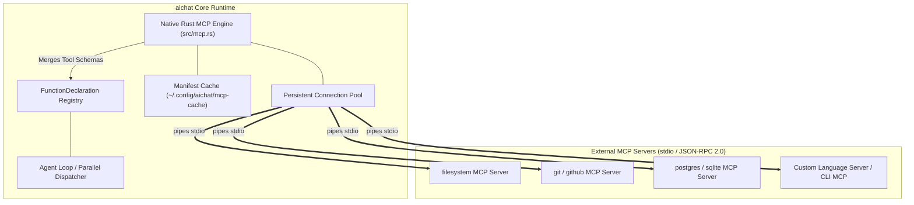
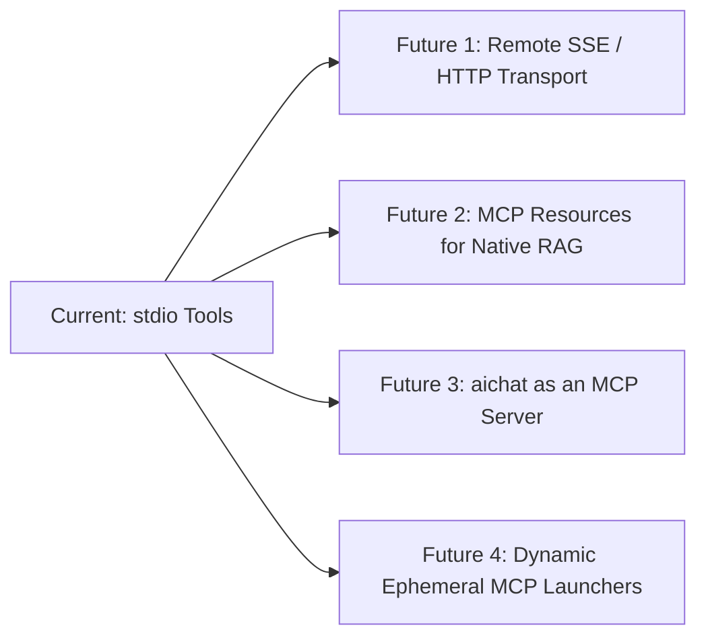

# Deep Dive: Model Context Protocol (MCP) in `aichat` — Capabilities, Evolution, and Future Potential

This document provides a comprehensive review of the **Model Context Protocol (MCP)** implementation in `aichat`, detailing its architectural evolution from external wrappers to a native in-process Rust engine, its current capabilities, and strategic future opportunities.

---

## 1. Executive Summary: What is MCP in `aichat`?

The Model Context Protocol (MCP) is an open standard introduced by Anthropic to standardize how LLMs connect with external data, tools, and developmental environments.

In this fork, MCP is implemented as a **100% native in-process Rust client** ([`src/mcp.rs`](file:///home/istari/projects/perry/src/mcp.rs)). It eliminates all third-party bridge dependencies (such as Node.js or Python middleware) and speaks JSON-RPC 2.0 directly over `stdio` to any compliant MCP server.



---

## 2. Evolution: From Node.js Bridge to Native Rust Engine

### Phase 0: Upstream Baseline
* **State:** Upstream `sigoden/aichat` had no native MCP support. All external tool calls had to be written as custom shell scripts in `llm-functions`.

### Phase 1: The Early External Bridge (Node.js)
* **State:** Relied on an external Node.js adapter process to translate between `aichat` and MCP servers.
* **Pain Points:** High process startup overhead, fragile dependency on Node.js/npm environments, poor signal handling (Ctrl+C would orphan child servers), and lack of per-agent isolation.

### Phase 2: The Native In-Process Rust Engine (Commit `3e95825`)
* **State:** Replaced the entire external stack with an asynchronous, 1,085-line native Rust implementation in [`src/mcp.rs`](file:///home/istari/projects/perry/src/mcp.rs).
* **Key Enhancements:**
  1. **Zero Runtime Dependencies:** Compiles directly into the `aichat` binary.
  2. **Seamless Dispatch:** MCP tools appear as standard `FunctionDeclaration` entries, completely indistinguishable from native bash scripts to the agent loop.
  3. **Manifest Caching:** Tool schemas are cached in `~/.config/aichat/mcp-cache/` so startup remains sub-millisecond without waiting for server discovery.
  4. **Connection Pooling:** Servers stay warm across multi-turn reasoning loops.

---

## 3. Current Architecture & Capabilities

### A. Configuration & Scoping
MCP servers can be declared globally in `config.yaml` or scoped locally to specific sub-agents in `agents/<name>/config.yaml`:

```yaml
# ~/.config/aichat/config.yaml or agents/coder/config.yaml
mcp_servers:
  - name: filesystem
    command: npx
    args: ["-y", "@modelcontextprotocol/server-filesystem", "/home/istari/projects"]
  - name: github
    command: github-mcp-server
    env:
      GITHUB_TOKEN: ${GITHUB_TOKEN} # Automatic $VAR expansion
    timeout: 30
```

### B. Core Features Implemented in `src/mcp.rs`
1. **Lazy Spawning & Connection Pooling:** Servers are only spawned when a tool from that server is actually called by the LLM. Once spawned, connections are maintained in a global connection pool.
2. **Agent-Level Override Hierarchy:** Agent-level MCP servers cleanly merge with global servers. On name collisions, the agent's private configuration takes precedence.
3. **Granular Tool Filtering (`use_tools`):** Agents can restrict their tool exposure to specific servers (e.g. `use_tools: "filesystem,git"`).
4. **Resilient Signal & Process Management:** MCP subprocesses are placed in dedicated Unix process groups (`process_group(0)`). Terminal signals (like user Ctrl+C) are handled gracefully by `aichat` without abruptly killing server state. On exit, servers receive SIGTERM with a 5-second graceful shutdown timeout.
5. **Cache Management:** `--sync-mcp` forces cache invalidation and rediscovery across all servers. `--info` displays live server status and tool counts.

---

## 4. Synergy with `llm-functions` and Sub-Agents

MCP and `llm-functions` do not compete—they **complement each other perfectly**:

| Tool Source | Best For | Execution Characteristics |
| :--- | :--- | :--- |
| **`llm-functions` (Bash / `argc`)** | Quick, local, deterministic Unix scripting (`fs_*`, `web_search`, `read_pdf`). | Instant startup (~0.05s), pure shell simplicity. |
| **MCP Servers** | Complex ecosystem integrations (GitHub API, Slack, Postgres, Docker, LSP language servers). | Long-running protocol bridges with rich structured schemas. |
| **Cognitive Sub-Agents** | Multi-turn reasoning loops (`orchestrator`, `researcher`). | Spawns isolated `aichat` subprocesses that consume both `llm-functions` and MCP tools. |

---

## 5. Strategic Potential & Future Roadmap



### Opportunity 1: Remote Transports (SSE & WebSockets)
* **Current:** stdio subprocesses only.
* **Potential:** Add Server-Sent Events (SSE) and HTTP/WebSocket transport support. This will allow `aichat` to connect directly to remote enterprise MCP gateways, cloud databases, and hosted AI tool providers without running local shims.

### Opportunity 2: MCP Resources & Prompts Integration
* **Current:** Implements MCP *Tools* (`tools/list`, `tools/call`).
* **Potential:**
  * **MCP Resources (`resources/read`):** Pipe live MCP resources directly into `aichat`'s native HNSW + BM25 RAG engine (`--rag`).
  * **MCP Prompts (`prompts/get`):** Allow MCP servers to expose prompt templates dynamically alongside roles.

### Opportunity 3: Bidirectional Server Mode (`aichat` as an MCP Server)
* **Potential:** Expose `aichat` itself (and the entire `llm-functions` suite) as an MCP Server (`aichat --serve-mcp`).
* **Impact:** Any external MCP client (such as Cursor, Claude Desktop, Zed, or VS Code) could immediately use your local bash tools, custom agents, and `aichat` models through a single standardized endpoint.
