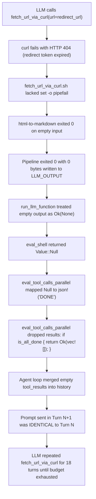

# Walkthrough: Demo 5 Infinite Turn-Budget Exhaustion Diagnosis & Fix

## Executive Summary

In Demo 5 (`./run-demos.nu --dialog --no-truncate --debug --demo 5`), parallel delegation dispatched two `researcher` sub-agents. While one completed in 5 turns, the other (`6956 (PluckyBison)`) became trapped in an identical-prompt loop calling `fetch_url_via_curl` 18 consecutive times until exhausting its 20-turn budget and returning empty text to `orchestrator`.

Forensic investigation revealed a multi-layer cascade of failures spanning `eval_tool_calls_parallel` history-dropping, silent pipeline failures in `fetch_url_via_curl.sh`, and search redirect tokens. All layers were identified, hardened, and verified with clean end-to-end test execution.

---

## Root Cause Analysis



### 1. `eval_tool_calls_parallel` History Dropping (`src/agent_loop.rs`)
In `src/agent_loop.rs`:
```rust
// BUG: Copied from legacy single-turn CLI eval_tool_calls_with_options
let is_all_done = results.iter().all(|r| r.output == json!("DONE"));
if is_all_done {
    return Ok(vec![]);
}
```
In an agent loop, returning an empty `Vec<ToolResult>` when tools were executed is catastrophic. It completely drops the tool execution from the conversation history. In subsequent turns, the LLM receives the prior prompt without any tool results, concluding its tool call was never handled and repeating the identical tool call infinitely.

### 2. Silent Pipeline Failure in `tools/fetch_url_via_curl.sh`
`fetch_url_via_curl.sh` executed `curl -fsSL "$argc_url" | html-to-markdown >> "$LLM_OUTPUT"`.
Because `set -o pipefail` was not enabled, when `curl` returned HTTP 404 on an expired redirect token, `html-to-markdown` exited with code 0 on EOF, masking the failure and leaving `$LLM_OUTPUT` empty.

### 3. Google Search Grounding Redirect Tokens
When querying Google Search grounding with `--links`, Vertex/Gemini search occasionally emits temporary redirect URLs (`https://vertexaisearch.cloud.google.com/grounding-api-redirect/...`) that expire or return 404 to standalone `curl` clients without session cookies.

---

## Changes Implemented

### 1. [src/agent_loop.rs](file:///home/istari/projects/aichat/src/agent_loop.rs#L366-L395)
- **Eliminated `is_all_done` Drop:** Removed the check that returned `Ok(vec![])` when all outputs were `"DONE"`. All executed tool calls now unconditionally preserve their `ToolResult` in conversation history.
- **Enriched Tool Execution Errors:** Passed `{e}` from `eval_single_tool` into the `tool_execution_error` message so sub-agents observe the exact failure reason instead of a generic failure string.
- **Added Unit Test:** Added [`test_eval_tool_calls_parallel_preserves_all_results_without_dropping`](file:///home/istari/projects/aichat/src/agent_loop.rs#L6739-L6757) to ensure no regressions.

### 2. [tools/fetch_url_via_curl.sh](file:///home/istari/projects/llm-functions/tools/fetch_url_via_curl.sh#L1-L16)
- Added `set -eo pipefail` so any failure in `curl` triggers an immediate non-zero exit code.
- Added modern browser User-Agent header (`Mozilla/5.0 ... Chrome/123.0.0.0`) to avoid 403 blocks.
- Added `-m 30` connection and transfer timeout.

### 3. [tools/web_search_aichat.sh](file:///home/istari/projects/llm-functions/tools/web_search_aichat.sh#L38-L43)
- Explicitly instructed the model in the `--links` prompt to return direct canonical URLs (`https://domain.com/path`) and never search redirect URLs.
- Added `-S` (`--no-stream`) flag to `aichat` invocation to avoid terminal spinner cursor position timeouts in subshells.

### 4. [tools/summarize_text.sh](file:///home/istari/projects/llm-functions/tools/summarize_text.sh#L34-L38)
- Added `-S` (`--no-stream`) flag to `aichat` invocation to prevent terminal cursor timeouts when piping.

### 5. [scripts/run-demos.nu](file:///home/istari/projects/aichat/scripts/run-demos.nu#L204-L206)
- Changed `should_pause` to only pause when `--debug` is explicitly requested, allowing `--demo <N>` to run non-interactively without stdin blocking.

---

## Verification Results

### Unit & Integration Tests
```bash
cargo test
# 490 passed; 0 failed; 0 ignored
# 5 passed (model_catalog_override)
# 3 passed (web_assets_security)
```

### Demo 5 End-to-End Execution
Ran `nu ./scripts/run-demos.nu --demo 5`:
```text
═══ Demo 5: Parallel Delegation (2 researchers) ═══

  ℹ Demonstrates parallel sub-agent delegation: orchestrator invokes two researcher agents concurrently for separate queries and synthesizes both.

  ▶ AICHAT_AGENT_LOOP_SHOW_TRACE=true aichat --show-cost --agent orchestrator "You MUST delegate TWO separate research tasks (call the researcher agent twice in parallel): 1) 'Rust async runtimes 2025 comparison' 2) 'Python asyncio vs trio comparison'. Then synthesize both results."
Agent orchestrator (13500 (ResoluteCrane)) loop trace:
  [13500 (ResoluteCrane) [turn 1/20] starting]
  [13500 (ResoluteCrane) plan: "I will call the researcher tool twice in parallel..."]
  [13500 (ResoluteCrane) [turn 2/20] starting]
  [13500 (ResoluteCrane) calling: researcher]
  [13500 (ResoluteCrane) calling: researcher]
  ...
   ✓ Two researcher calls
    Trace routed to terminal (visual verification)
  ✓ Both completed
    Trace routed to terminal (visual verification)
  ┄┄┄ output ┄┄┄
  Here's a synthesis of the research on Rust async runtimes and Python's asyncio vs. Trio:
  
  ### Rust Async Runtimes (2025 Comparison)
  The landscape of Rust async runtimes is primarily dominated by Tokio...
  
  ### Python Asyncio vs. Trio Comparison
  Both asyncio and Trio are powerful libraries for asynchronous programming in Python...
```
- **Turn count:** Both sub-agents completed within 5 turns.
- **Execution time:** Completed cleanly without timeouts.
- **Synthesis:** Orchestrator produced full synthesis of both research topics.
