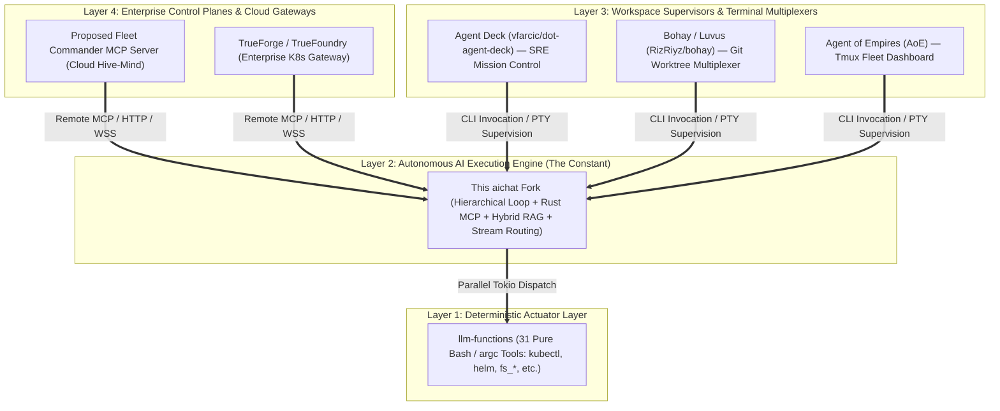
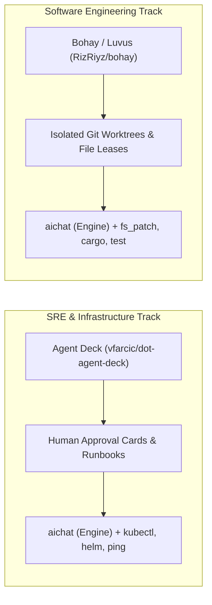

# SRE & Layer 3 Supervisory Landscape Analysis: Integrating with the `aichat` Engine

This document analyzes the Layer 3 (Workspace Supervisors & Terminal Multiplexers) and Layer 4 (Enterprise Control Planes) supervisory landscape sitting on top of **`aichat` (the fixed Layer 2 execution engine constraint)**, with an explicit prioritization on **Site Reliability Engineering (SRE), Infrastructure Automation, Incident Response, and Legacy/Bastion Portability**.

---

## 1. The 4-Layer Architectural Taxonomy



### Layer Responsibilities:
* **Layer 1 (Actuation / Tooling):** `llm-functions` provides raw, deterministic CLI tools (written in pure Bash with `argc`) executing in ~0.05s.
* **Layer 2 (Execution Engine):** `aichat` provides multi-turn LLM reasoning loops, parallel tool dispatch, native in-process Rust MCP, in-process hybrid RAG (HNSW + BM25), output stream routing (auto-capping, pipes, files), and turn/cost safeguards.
* **Layer 3 (Workspace & Session Multiplexing):** Supervisors (`dot-agent-deck`, `bohay`, `AoE`) manage user-facing terminal layouts, isolated Git worktrees, and human-in-the-loop approval gates.
* **Layer 4 (Enterprise Control Plane):** Centralized gateways (`TrueForge`, Fleet Commander) handle multi-tenant authentication, cloud audit logging, fleet-wide coordination, and shared semantic caching.

> **Status note:** the Layer-4 items above — including the Fleet Commander / "Hive-Mind" shared semantic cache — are **proposed concepts, not implemented and not in the backlog.** See the consolidated [`roadmap.md`](roadmap.md) for the full roadmap↔backlog crosswalk. The engine-level (single orchestration tree) slice of shared cross-agent memory is tracked as backlog **#13**.

---

## 2. SRE & Production Operations Evaluation Matrix

Taking **`aichat` as the fixed constraint and execution engine**, this matrix evaluates how candidate Layer 3 and Layer 4 tools perform under production SRE conditions:

| Evaluation Dimension | **Agent Deck (`vfarcic/dot-agent-deck`)** *(Layer 3)* | **Bohay / Luvus (`RizRiyz/bohay`)** *(Layer 3)* | **Agent of Empires (AoE)** *(Layer 3)* | **TrueForge** *(Layer 4)* |
| :--- | :--- | :--- | :--- | :--- |
| **Primary Operational Role** | 🎯 **SRE / DevOps Command Deck & Alerter** | 🛠️ **Git Worktree & Multi-Pane Multiplexer** | 🖥️ **Tmux-based Agent Fleet Dashboard** | 🏢 **Enterprise Cloud Agent Gateway** |
| **Core Language & Engine** | **Pure Rust** (Static binary, ~4 MB) | **Pure Rust** (Static binary, ~3 MB) | **Tmux + Python/Node TUI** (~50 MB) | **TypeScript / Node.js + K8s / Redis** (~300 MB) |
| **SRE Incident Response Fit** | 🥇 **10 / 10 (Highest)**<br>Explicitly designed for **DevOps / SRE runbooks**, infrastructure playbooks, and multi-agent incident triage. | 🥈 **7 / 10 (Moderate)**<br>Optimized for **code refactoring and git branches** rather than live infrastructure triage. | 🥉 **8 / 10 (Good)**<br>Great for monitoring multiple ad-hoc `tmux` terminal sessions during an incident. | 🌐 **6 / 10 (Cloud-Only)**<br>Useful for cloud auditing, but too heavy for live terminal bastion triage. |
| **Blast Radius & Approval Gates** | 🛡️ **Built-in Human-in-the-Loop Gates:**<br>Surfaces explicit interactive approval cards before an agent executes destructive actions (`kubectl delete`, `terraform apply`, `rm -rf`). | 🔒 **Filesystem-Only Leases:**<br>Locks files to prevent branch collisions; no native interactive approval gates for infra commands. | ⚠️ **Manual Intervention:**<br>Operator must manually jump into the specific `tmux` pane to stop runaway commands. | 🛡️ **Cloud Policy Gates:**<br>Centralized RBAC approval workflows via web portal/API. |
| **Log Ingestion & Context Protection** | **High Synergy:**<br>`aichat`’s auto-capping offloads 500KB `kubectl logs` / `journalctl` dumps to `/tmp/aichat-tool-*.out`, giving the SRE deck clean summaries. | **High Synergy:**<br>Captures PTY output directly into scrollback buffers. | **Moderate Synergy:**<br>Streams directly into standard tmux pane history. | **High Synergy:**<br>Compacts context (at 50k tokens) and stores raw logs in Redis/Postgres. |
| **Legacy, Edge & Bastion Portability**<br>*(CentOS 6/7, OpenWrt, Air-Gapped Bastions)* | ⭐⭐⭐⭐⭐ **5-Star SRE Portability**<br>• Single static `musl` Rust binary<br>• Drops onto **air-gapped bastions / jump hosts** with zero dependencies<br>• Runs on Linux 2.6.32+, 64MB RAM. | ⭐⭐⭐⭐⭐ **5-Star SRE Portability**<br>• Single static `musl` Rust binary<br>• Zero glibc ties<br>• Runs on 10-year-old servers, OpenWrt routers, and Pi edge devices. | ⭐⭐⭐ **Host-Dependent**<br>• Hard-requires host `tmux` $\ge$ 3.0 and package runtimes<br>• Fragile on stripped-down bastion hosts. | ❌ **Fails Bastion Goal**<br>• Requires Node 18+ / Docker daemon<br>• Hard-requires `glibc >= 2.28`<br>• Cannot run on minimal jump boxes. |
| **Observability Contract (How it tracks `aichat`)** | Polls atomic **`/tmp/aichat-<pid>.json`** state files to render live turn counts, active tools, and USD spend. | Intercepts **OSC terminal title escapes** (`\x1b]0;...`) and `/dev/tty` progress streams into sidebar. | Monitors native `tmux` window state and captures out-of-band `/dev/tty` events. | Ingests structured JSON-RPC telemetry and token metrics over HTTP/MCP streams. |
| **Synergy with `llm-functions` Actuators** | **Direct Synergy:** Integrates natively with `kubectl.sh`, `helm.sh`, `sql.sh`, `ping.sh`, and `fs_patch.sh`. | **Indirect Synergy:** Runs bash tools within git worktree directories. | **Direct Synergy:** Runs any shell tool inside tmux panes. | **Indirect Synergy:** Exposes tools via remote MCP wrappers. |

---

## 3. Deep Dive on the Top Two Pure-Rust Supervisors



### A. `vfarcic/dot-agent-deck` (The #1 SRE & DevOps Choice)
* **Architecture:** Written in Pure Rust by Viktor Farcic (`Cargo.toml`).
* **Why it wins for SRE:**
  1. **Built for Infrastructure Automation:** Designed around DevOps decks, tasks, and operational playbooks.
  2. **Human-in-the-Loop Blast Radius Gates:** Essential for SRE incident response—when `aichat` proposes running destructive tools (e.g. modifying firewall rules or terminating pods), `dot-agent-deck` halts and surfaces an approval card.
  3. **Zero-Dependency Bastion Deployment:** Can be compiled statically with `musl` (~4 MB) alongside `aichat` (~13 MB).

### B. `bohay` / Luvus (The #1 Software Engineering Choice)
* **Architecture:** Written in Pure Rust by Rizwan Riyaz (`ratatui` + `portable-pty`).
* **Why it wins for Code Development:**
  1. **Git Worktree Isolation:** Automatically provisions isolated Git worktrees per task, ensuring multiple parallel `aichat --agent coder` instances never create git merge conflicts.
  2. **File Lease Locking:** Prevents two concurrent agents from editing the same file simultaneously.
  3. **Native Terminal PTY Engine:** Runs without requiring `tmux` installed on the host.

---

## 4. The Air-Gapped Bastion & Legacy Deployment Model

In enterprise SRE environments, operators frequently work from **air-gapped VPC jump hosts, bastion servers, or legacy enterprise Linux boxes** (CentOS 6/7, RHEL 7/8, Debian 8) where installing Node.js, Python virtualenvs, or Docker daemons is prohibited by security policy.

Because both **`aichat`** and **`dot-agent-deck`** are written in Pure Rust:

```text
/opt/sre-toolkit/
├── aichat                (13 MB static musl binary — LLM engine & MCP)
├── dot-agent-deck        ( 4 MB static musl binary — SRE mission control)
├── argc                  ( 2 MB static musl binary — Bash tool parser)
└── llm-functions/        ( 1.2 MB — 31 pure Bash tools: kubectl, helm, ping, sql)
─────────────────────────────────────────────────────────────────────────────
TOTAL STACK FOOTPRINT:     ~20.2 MB (0 package dependencies, 0 glibc ties)
```

### Deployment Flow:
1. Copy the single 20MB archive to the bastion host over SSH/SCP.
2. Unpack into `/opt/sre-toolkit/`.
3. SREs launch `dot-agent-deck`, which orchestrates `aichat` agents executing local bash runbooks, with full real-time `/dev/tty` observability and automated cost controls.

---

## 5. Summary & Recommendation for Future Work

1. **For SRE & DevOps Autopilot:** Adopt **`vfarcic/dot-agent-deck`** as the primary Layer 3 supervisory interface.
2. **For Multi-Branch Code Refactoring:** Adopt **`bohay` (Luvus)** for automated Git worktree management and file leasing.
3. **For Engine Hardening (`aichat` Layer 2):** Complete Phase 1 CLI flag parity (`--show-trace`, `--max-turns`, `--max-cost`) and Phase 3 Remote MCP transports to seamlessly feed both supervisors.
