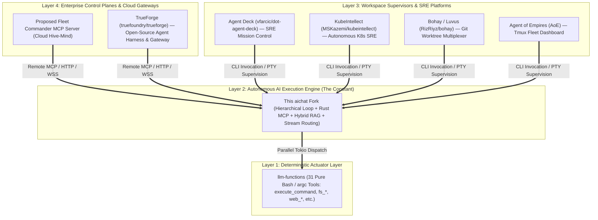
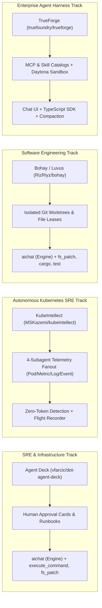

# SRE & Layer 3 Supervisory Landscape Analysis: Integrating with the `aichat` Engine

This document analyzes the Layer 3 (Workspace Supervisors, SRE Platforms & Terminal Multiplexers) and Layer 4 (Enterprise Control Planes) supervisory landscape sitting on top of **`aichat` (the fixed Layer 2 execution engine constraint)**, with an explicit prioritization on **Site Reliability Engineering (SRE), Infrastructure Automation, Incident Response, and Legacy/Bastion Portability**.

---

## 1. The 4-Layer Architectural Taxonomy



### Layer Responsibilities:
* **Layer 1 (Actuation / Tooling):** `llm-functions` provides raw, deterministic CLI tools (written in pure Bash with `argc`) executing in ~0.05s.
* **Layer 2 (Execution Engine):** `aichat` provides multi-turn LLM reasoning loops, parallel tool dispatch, native in-process Rust MCP, in-process hybrid RAG (HNSW + BM25), output stream routing (auto-capping, pipes, files), and turn/cost safeguards.
* **Layer 3 (Workspace & Session Multiplexing / Specialized SRE):** Supervisors (`dot-agent-deck`, `bohay`, `AoE`) and specialized operational frameworks (`kubeintellect`) manage user-facing terminal layouts, isolated Git worktrees, telemetry correlation, and human-in-the-loop approval gates.
* **Layer 4 (Enterprise Control Plane & Gateways):** Centralized gateways (`TrueForge`, Fleet Commander) handle multi-tenant authentication, cloud audit logging, fleet-wide coordination, centralized MCP catalogs, and shared semantic caching.

> **Status note:** the Layer-4 items above — including the Fleet Commander / "Hive-Mind" shared semantic cache — are **proposed concepts, not implemented and not in the backlog.** See the consolidated [`roadmap.md`](roadmap.md) for the full roadmap↔backlog crosswalk. The engine-level (single orchestration tree) slice of shared cross-agent memory is tracked as backlog **#13**.

---

## 2. SRE & Production Operations Evaluation Matrix

Taking **`aichat` as the fixed constraint and execution engine**, this matrix evaluates how candidate Layer 3 and Layer 4 tools perform under production SRE conditions:

| Evaluation Dimension | **Agent Deck (`vfarcic/dot-agent-deck`)** *(Layer 3)* | **KubeIntellect (`MSKazemi/kubeintellect`)** *(Layer 3 / K8s SRE)* | **Bohay / Luvus (`RizRiyz/bohay`)** *(Layer 3)* | **TrueForge (`truefoundry/trueforge`)** *(Layer 4 / Harness)* | **Agent of Empires (AoE)** *(Layer 3)* |
| :--- | :--- | :--- | :--- | :--- | :--- |
| **Primary Operational Role** | 🎯 **SRE / DevOps Command Deck & Alerter** | ☸️ **Autonomous Kubernetes SRE & Incident RCA** | 🛠️ **Git Worktree & Multi-Pane Multiplexer** | 🏢 **Open-Source Agent Harness & Gateway** | 🖥️ **Tmux-based Agent Fleet Dashboard** |
| **Core Language & Engine** | **Pure Rust** (Static binary, ~4 MB) | **Python 3.12+ / FastAPI / LangGraph** (~250 MB) | **Pure Rust** (Static binary, ~3 MB) | **TypeScript / Node.js / React** (~300 MB) | **Tmux + Python/Node TUI** (~50 MB) |
| **SRE Incident Response Fit** | 🥇 **10 / 10 (Highest)**<br>Explicitly designed for **DevOps / SRE runbooks**, infrastructure playbooks, and multi-agent incident triage. | 🥇 **10 / 10 (Deepest K8s RCA)**<br>Specialized for Kubernetes incidents; coordinates `kubectl`, Prometheus (PromQL), and Loki (LogQL). | 🥈 **7 / 10 (Moderate)**<br>Optimized for **code refactoring and git branches** rather than live infrastructure triage. | 🌐 **6 / 10 (Cloud / Gateway)**<br>Web UI, scheduling, and API harness; heavier footprint for bastion triage. | 🥉 **8 / 10 (Good)**<br>Great for monitoring multiple ad-hoc `tmux` terminal sessions during an incident. |
| **Blast Radius & Approval Gates** | 🛡️ **Interactive Approval Cards:**<br>Halts before destructive CLI actions (`kubectl delete`, `terraform apply`, `rm -rf`). | 🛡️ **Strict Safe-by-Default Gates:**<br>Read-only queries run automatically; mutating ops (`scale`, `delete`, `restart`) require explicit HITL approval; RBAC enforcement. | 🔒 **Filesystem-Only Leases:**<br>Locks files to prevent branch collisions; no native interactive approval gates for infra commands. | 🛡️ **Tool Approval Checkpoints:**<br>Human checkpoints and Generative UI approval in chat and API runs. | ⚠️ **Manual Intervention:**<br>Operator must manually jump into the specific `tmux` pane to stop runaway commands. |
| **Log Ingestion & Context Protection** | **High Synergy:**<br>`aichat`’s auto-capping offloads 500KB `kubectl logs` / `journalctl` dumps to `/tmp/aichat-tool-*.out`. | **High Specialization:**<br>Dedicated subagents for PromQL and LogQL query compaction; temporal memory and graph filtering. | **High Synergy:**<br>Captures PTY output directly into scrollback buffers. | **High Synergy:**<br>Large-result offloading, deferred tool loading, and automatic context compaction. | **Moderate Synergy:**<br>Streams directly into standard tmux pane history. |
| **Legacy, Edge & Bastion Portability**<br>*(CentOS 6/7, OpenWrt, Air-Gapped Bastions)* | ⭐⭐⭐⭐⭐ **5-Star SRE Portability**<br>• Single static `musl` Rust binary<br>• Zero external dependencies<br>• Runs on Linux 2.6.32+, 64MB RAM. | ⭐⭐ **Heavy Host Requirements**<br>• Requires Python 3.12+, FastAPI, LangGraph<br>• Needs Docker/Kind/K8s cluster access<br>• Difficult on stripped bastions. | ⭐⭐⭐⭐⭐ **5-Star SRE Portability**<br>• Single static `musl` Rust binary<br>• Zero glibc ties<br>• Runs on 10-year-old servers and edge routers. | ⭐ **Fails Minimal Bastion Goal**<br>• Requires Node 18+, Docker/Compose, or K8s<br>• SQLite local or Postgres/Redis hosted<br>• Cannot run on bare jump boxes. | ⭐⭐⭐ **Host-Dependent**<br>• Hard-requires host `tmux` $\ge$ 3.0 and package runtimes<br>• Fragile on stripped-down bastion hosts. |
| **Observability Contract** | Polls atomic **`/tmp/aichat-<pid>.json`** state files for turns, active tools, and USD spend. | Structured API events, **Flight Recorder** (hash-chained decision logs), and `kq replay`. | Intercepts **OSC terminal title escapes** (`\x1b]0;...`) and `/dev/tty` progress streams into sidebar. | OpenAPI HTTP stream, TypeScript SDK events, session persistence (SQLite/Postgres). | Monitors native `tmux` window state and captures out-of-band `/dev/tty` events. |
| **Synergy with `llm-functions` Actuators** | **Direct Synergy:** Integrates natively with `execute_command.sh`, `fs_patch.sh`, and `execute_sql_code.sh` (executes raw `kubectl` / `helm` commands via `execute_command.sh`). | **Architectural Blueprint:** Demonstrates need for dedicated Kubernetes (`kubectl.sh`), Helm (`helm.sh`), Prometheus (`promql.sh`), and Loki (`logql.sh`) actuators. | **Indirect Synergy:** Runs bash tools within git worktree directories. | **Indirect Synergy:** Connects tools via remote MCP server catalogs. | **Direct Synergy:** Runs any shell tool inside tmux panes. |

---

## 3. Deep Dive on Selected Supervisors & Platforms



### A. `vfarcic/dot-agent-deck` (The #1 General SRE & DevOps Choice)
* **Architecture:** Written in Pure Rust by Viktor Farcic (`Cargo.toml`).
* **Why it wins for general SRE:**
  1. **Built for Infrastructure Automation:** Designed around DevOps decks, tasks, and operational playbooks.
  2. **Human-in-the-Loop Blast Radius Gates:** Essential for SRE incident response—when `aichat` proposes running destructive tools (e.g. modifying firewall rules or terminating pods), `dot-agent-deck` halts and surfaces an interactive approval card.
  3. **Zero-Dependency Bastion Deployment:** Can be compiled statically with `musl` (~4 MB) alongside `aichat` (~13 MB).

### B. `MSKazemi/kubeintellect` (The #1 Kubernetes RCA & Observability Reference)
* **Architecture:** Python 3.12+ monorepo (`kubeintellect-server`, `kube-q`, `ki-protocol`) utilizing FastAPI and LangGraph (Mohsen Seyedkazemi Ardebili, DOI: 10.1007/s10723-026-09837-6).
* **Key Strengths for Production K8s Operations:**
  1. **4-Pillar Telemetry Correlation:** Fans out complex incidents across 4 specialized parallel subagents:
     - **Pod Subagent** (`kubectl` resource inspection)
     - **Metrics Subagent** (Prometheus / PromQL trend analysis)
     - **Logs Subagent** (Loki / LogQL log analysis)
     - **Events Subagent** (`kubectl events` timeline extraction)
  2. **Safe-by-Default Governance:** Read-only queries run automatically, but mutating commands (`scale`, `delete`, `restart`) hard-pause for operator confirmation under RBAC rules (admin/operator/readonly).
  3. **Zero-Token Detection:** Compiles cluster playbook predicates to catch common failures without burning LLM tokens (`kq findings`).
  4. **Flight Recorder & Replayability:** Every decision is hash-chained and auditable via `kq replay <session>`, with rollback points armed before mutations execute.
  5. **Temporal Memory Hierarchy:** Preserves past incident episodes and bi-temporal knowledge graphs with Personalized PageRank (PPR) blast-radius calculation.
* **Role in our Landscape:**
  - Too heavy for bare legacy bastions, but serves as the **gold standard reference** for multi-telemetry SRE triage.
  - Can be invoked as an upstream cluster specialist tool by `aichat` via the `kq` CLI or HTTP API.

### C. `bohay` / Luvus (The #1 Software Engineering Choice)
* **Architecture:** Written in Pure Rust by Rizwan Riyaz (`ratatui` + `portable-pty`).
* **Why it wins for Code Development:**
  1. **Git Worktree Isolation:** Automatically provisions isolated Git worktrees per task, ensuring multiple parallel `aichat --agent coder` instances never create git merge conflicts.
  2. **File Lease Locking:** Prevents two concurrent agents from editing the same file simultaneously.
  3. **Native Terminal PTY Engine:** Runs without requiring `tmux` installed on the host.

### D. `truefoundry/trueforge` (Open-Source Agent Harness & Enterprise Control Plane)
* **Architecture:** TypeScript / Node.js harness providing a chat UI, OpenAPI HTTP API, TypeScript SDK (`@truefoundry/trueforge-sdk`), and embeddable UI (`@truefoundry/trueforge-ui`). Supports SQLite (local) or Postgres + Redis (hosted).
* **Key Capabilities:**
  1. **Catalog-Driven Infrastructure:** Reusable YAML catalogs for LLM providers, remote MCP servers (with OAuth and header auth), and `SKILL.md` instruction packs.
  2. **Daytona Sandbox-as-a-Tool:** Isolated ephemeral compute and file sandboxing for untrusted code execution.
  3. **Context Engineering:** Large-result offloading, deferred tool loading, Code Mode, and automatic session compaction.
  4. **Unattended Automation:** Built-in cron scheduling for recurring agent runs.
* **Role in our Landscape:**
  - TrueForge is a complete agent harness rather than a lightweight terminal multiplexer. In an architecture where `aichat` is the Layer 2 engine, TrueForge's runtime would duplicate `aichat`'s execution loop.
  - However, for Layer 4 enterprise control, TrueForge demonstrates how to structure **remote MCP catalogs**, **sandboxed tool execution**, and **human checkpointing** in web/API environments.

---

## 4. The Air-Gapped Bastion & Legacy Deployment Model

In enterprise SRE environments, operators frequently work from **air-gapped VPC jump hosts, bastion servers, or legacy enterprise Linux boxes** (CentOS 6/7, RHEL 7/8, Debian 8) where installing Node.js, Python virtualenvs, or Docker daemons is prohibited by security policy.

Because both **`aichat`** and **`dot-agent-deck`** are written in Pure Rust:

```text
/opt/sre-toolkit/
├── aichat                (13 MB static musl binary — LLM engine & MCP)
├── dot-agent-deck        ( 4 MB static musl binary — SRE mission control)
├── argc                  ( 2 MB static musl binary — Bash tool parser)
└── llm-functions/        ( 1.2 MB — 31 pure Bash/argc tools: execute_command, fs_*, web_*, sql)
─────────────────────────────────────────────────────────────────────────────
TOTAL STACK FOOTPRINT:     ~20.2 MB (0 package dependencies, 0 glibc ties)
```

### Contrast with Containerized / Runtime-Heavy Frameworks:
* **`kubeintellect`:** ~250 MB+ (Python 3.12, LangGraph, FastAPI, SQLite/PostgreSQL, Kind/Docker). Outstanding for in-cluster or hosted SRE control, but requires runtime packages prohibited on minimal bastions.
* **`trueforge`:** ~300 MB+ (Node.js runtime, npm packages, Daytona daemon, Redis/Postgres for hosted mode).

### Deployment Flow for Bastions:
1. Copy the single 20MB archive to the bastion host over SSH/SCP.
2. Unpack into `/opt/sre-toolkit/`.
3. SREs launch `dot-agent-deck`, which orchestrates `aichat` agents executing local bash runbooks, with full real-time `/dev/tty` observability and automated cost controls.

---

## 5. Architectural Lessons & Synergy for `aichat`

Examining KubeIntellect and TrueForge highlights three strategic capabilities to adopt into the `aichat` and `llm-functions` ecosystem:

1. **Develop Dedicated SRE Actuators in `llm-functions` (from KubeIntellect):**
   - Currently, `llm-functions` relies on generic shell execution (`execute_command.sh`) to run infrastructure tools like `kubectl` and `helm`.
   - Developing dedicated, structured `argc` Bash actuators for Kubernetes (`kubectl.sh`), Helm (`helm.sh`), **Prometheus** (`prometheus.sh` / PromQL), and **Loki** (`loki.sh` / LogQL) would equip `aichat` with KubeIntellect's 4-pillar triage model while providing bounded parameter validation and sub-millisecond execution.
2. **Zero-Token Pre-Flight Triage:**
   - KubeIntellect's use of compiled playbook predicates before calling the LLM aligns with `aichat`'s philosophy of deterministic token efficiency.
   - SRE scripts can evaluate cluster health metrics locally before triggering an autonomous `aichat` reasoning loop.
3. **Immutable Decision Auditing & Rollback Arming:**
   - KubeIntellect's flight recorder concept reinforces the value of `aichat`'s `--show-trace` and atomic state dumping (`/tmp/aichat-<pid>.json`) for incident post-mortems and compliance auditability.
4. **Catalog-Based Remote MCP & Sandbox Offloading (from TrueForge):**
   - TrueForge's approach to YAML-defined MCP catalogs and ephemeral Daytona sandboxes offers a clean reference for implementing Backlog #12 (Remote MCP transports) in `aichat`.

---

## 6. Summary & Recommendation for Future Work

1. **For Air-Gapped Bastion SRE & DevOps Autopilot:** Adopt **`vfarcic/dot-agent-deck`** as the primary Layer 3 supervisory interface over `aichat`.
2. **For Kubernetes Incident Correlation & Observability:** Incorporate KubeIntellect's **4-pillar correlation pattern** into `llm-functions` by implementing dedicated actuators (`kubectl.sh`, `helm.sh`, `prometheus.sh`, and `loki.sh`), and use `kq` CLI integration where cluster connectivity permits.
3. **For Multi-Branch Code Refactoring:** Adopt **`bohay` (Luvus)** for automated Git worktree management and file leasing.
4. **For Engine Hardening (`aichat` Layer 2):** Complete Phase 1 CLI flag parity (`--show-trace`, `--max-turns`, `--max-cost`) and Phase 3 Remote MCP transports to feed both terminal supervisors and enterprise harnesses.
