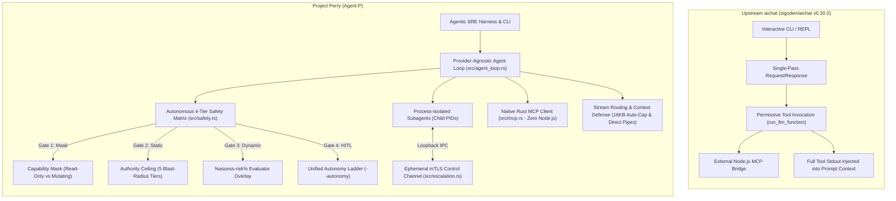

# Upstream AIChat (`sigoden/aichat`) vs. Project Perry (Agent P): Comprehensive Architectural & Quantitative Comparison

**Date / Timestamp:** `2026-09-18T11:02:10-04:00`  
**Status:** Canonical Architectural Comparison Document  
**Target Repositories:**  
- **Upstream Baseline:** `https://github.com/sigoden/aichat` (last official release [`v0.30.0`](https://github.com/sigoden/aichat/releases/tag/v0.30.0))  
- **Project Perry (Agent P):** `https://github.com/fujibearly/Perry.git` (`HEAD`)  

---

## 1. Executive Summary

Project Perry (Agent P) began as a high-performance fork of `sigoden/aichat` and has since diverged into an autonomous, provider-agnostic LLM command-line engine and SRE agentic harness. While upstream `aichat` was designed primarily as a single-turn interactive CLI/REPL with synchronous tool calling and hybrid RAG, Perry has expanded into an autonomous multi-turn execution engine featuring process-isolated subagents, a 4-layer actuation safety and governance matrix, native in-process Model Context Protocol (MCP), and ephemeral mutual-TLS supervisory escalation.

In terms of code volume, Perry contains **nearly 3.0× the Rust source code** of upstream `aichat v0.30.0` (+198% in `src/`), and more than **2.5× the overall repository footprint** (+155% total tracked lines).

---

## 2. Quantitative Comparison

### 2.1 Codebase Scale & Line Metrics

| Metric | Upstream AIChat ([`v0.30.0`](https://github.com/sigoden/aichat/releases/tag/v0.30.0)) | Project Perry ([`HEAD`](file:///home/istari/projects/perry)) | Net Growth / Delta |
| :--- | :--- | :--- | :--- |
| **Rust Source Engine (`src/`)** | 16,715 lines | **49,199 lines** | **+32,484 lines (+194%)** |
| **Rust Integration Tests (`tests/`)** | 0 lines (in-tree) | **632 lines** | **+632 lines (New)** |
| **Total Rust Code** | 16,715 lines | **49,831 lines** | **+33,116 lines (+198% / ~3.0×)** |
| **Automation & Verification (`scripts/`)** | ~200 lines (shell scripts) | **1,900 lines** (Nushell + shell) | **+1,700 lines (+850%)** |
| **Architectural Specs & Governance (`.kiro/`, `*.md`)**| ~1,000 lines | **14,341 lines** | **+13,341 lines (14.3×)** |
| **Model Catalogs, Configs & Web Assets** | ~14,186 lines | **15,910 lines** | **+1,724 lines (+12%)** |
| **Total Tracked Codebase** | **32,101 lines** | **81,982 lines** | **+49,881 lines (+155% / ~2.6×)** |
| **Git Diff vs. Upstream `v0.30.0`** | — | **143 files changed** | **+52,379 insertions, -2,752 deletions** |

### 2.2 Compiled Binary Footprint

| Artifact | Optimization Profile | Size (Disk) | Byte Count |
| :--- | :--- | :--- | :--- |
| **`target/release/perry`** | `opt-level = "z"`, `lto = true`, `strip = true` | **13.6 MB** | `14,245,616 bytes` |
| **`target/release/aichat` (Upstream v0.30.0)** | `opt-level = "z"`, `lto = true`, `strip = true` | **~9.5 MB** | `~9,980,000 bytes` |
| **`target/debug/perry`** | `opt-level = 0`, full debug symbols | **301.4 MB** | `316,031,864 bytes` |

*Note: The ~4.1 MB release delta in Perry accounts for the embedded native JSON-RPC MCP client engine, ephemeral mutual-TLS certificate generator (`rcgen` + `rustls`), `bm25` + `hnsw_rs` hybrid retrieval, and the autonomous multi-turn agent loop runtime.*

---

## 3. High-Level Architectural Crosswalk



---

## 4. Subsystem Deep-Dive

### 4.1 Provider-Agnostic Agent Loop (`src/agent_loop.rs` — 8,947 lines)
* **Upstream:** Executes single request/response cycles. When a tool call is parsed, it runs synchronously inside `run_llm_function` and terminates the turn. There is no multi-turn state machine, concurrency bounds, or cost tracking.
* **Perry:** Implements a fully autonomous, provider-agnostic turn state machine:
  - **Parallel Tool Evaluation:** Up to 8 concurrent tool invocations managed by Tokio semaphores.
  - **Budgets & Guardrails:** Configurable `max_turns` turn limits and `max_cost` USD expenditure ceilings.
  - **Live Terminal Observability:** Writes real-time trace events directly to the controlling terminal (`/dev/tty`), preventing output buffering.
  - **Transient Retry Backoff:** Exponential backoff and error recovery for rate-limited or transient upstream provider errors.
  - **Hybrid Planning:** Built-in `_plan` scratchpad pseudo-tool for task decomposition before actuation.

### 4.2 Actuation Safety & Governance Matrix (`src/safety.rs` — 2,885 lines)
* **Upstream:** Completely permissive execution. Any tool exposed in `functions.json` runs immediately with the ambient privileges of the user process.
* **Perry:** Implements an enterprise-grade defense-in-depth safety funnel:
  1. **Gate 1 — Capability Mask (`AICHAT_CAPABILITY_MASK`):** Enforces hard process boundaries (`readonly` vs `mutating`). A sub-agent provisioned under a read-only mask cannot execute state-changing actions.
  2. **Gate 2 — Deterministic Authority Ceilings:** 5-tier static blast-radius taxonomy (`Safe`, `Reversible`, `Disruptive`, `Destructive`, `Catastrophic`) coupled with non-pardonable Protected Policy Files (`policy.yaml`).
  3. **Gate 3 — Evaluator Overlay (`%assess-risk%`):** Dynamic LLM risk evaluator that can strictly heighten scrutiny or veto actions, but can never relax static ceilings ("the LLM is not a Pardoner").
  4. **Gate 4 — Unified Autonomy Ladder:** CLI macro presets (`--autonomy <readonly|consult|reversible>`) coordinating 2D safety boundaries without triggering double-prompt traps.

### 4.3 Ephemeral mTLS Supervisory Control Channel (`src/escalation.rs` — 1,507 lines)
* **Upstream:** Does not support sub-agents or inter-process communication.
* **Perry:** Subagents run as independent OS processes (`AICHAT_AGENT_DEPTH > 0`). When a subagent encounters an action exceeding its delegated ceiling:
  - Connects to parent orchestrator over a private Unix domain socket.
  - Secures the transport with in-memory self-signed mutual TLS (`rcgen` + `rustls`) pinned to per-tree SHA-256 fingerprints.
  - Passes structured escalation payloads (`HelloMsg`, `EscalationMsg`, `VerdictMsg`) for parent supervisory evaluation.

### 4.4 Zero-Node Native Model Context Protocol Client (`src/mcp.rs` — 1,139 lines)
* **Upstream:** Relied on an external Node.js bridge script to spawn and communicate with MCP servers, violating the zero-dependency CLI philosophy.
* **Perry:** Features a native, pure-Rust asynchronous MCP client embedded directly in the binary:
  - Speaks JSON-RPC 2.0 over standard I/O pipes.
  - Fast startup (milliseconds vs seconds with Node.js).
  - Maintains strict static binary portability for bastion host deployments.

### 4.5 Context Window Defense & Declarative Stream Routing (`src/function.rs` — 1,542 lines)
* **Upstream:** The raw standard output of every tool invocation was stuffed entirely into the next LLM prompt context window.
* **Perry:** Context pollution defenses:
  - **Automatic Capping:** Outputs exceeding 16KB are automatically spilled to temporary files, injecting an abbreviated preview with line-count hints into the LLM context.
  - **Declarative Output Routing:** Tools declare output destinations (`context`, `file`, or `pipe`).
  - **Acyclic Pipelines:** Multi-tool chains (e.g. `fetch_url` $\rightarrow$ `grep`) pipe data directly at machine speed without incurring intermediate LLM round-trip token costs.

### 4.6 Extended Provider APIs & Responses API (`src/client/openai_responses.rs` — 5,360 lines)
* **Upstream:** Basic OpenAI Chat Completions API.
* **Perry:** Comprehensive client for the OpenAI Responses API:
  - Integrated link exploration and web search grounding (`--wslinks`).
  - Native reasoning token parsing and display.
  - OpenAI processing service tier control (`--service-tier auto|default|flex|priority`).

### 4.7 Automated Test & Verification Harness (`scripts/run-demos.nu` — 1,725 lines)
* **Upstream:** Minimal shell-based test wrappers.
* **Perry:** Automated Nushell test harness featuring **24 live end-to-end demonstrations**:
  - Validates multi-agent delegation, subagent crash isolation, runbook taint propagation, mTLS escalations, and autonomy ladders across live LLM backends.

---

## 5. Major Source File Breakdown in Perry (`src/`)

```
src/
├── agent_loop.rs              8,947 lines  (Autonomous state machine, preflight gates, live trace)
├── client/
│   ├── openai_responses.rs    5,360 lines  (Responses API, multi-agent, hosted web search)
│   ├── claude.rs              1,796 lines  (Anthropic Claude API client & streaming)
│   ├── common.rs              1,540 lines  (Shared client primitives & payload mappers)
│   ├── stream.rs              1,178 lines  (SSE event parsers & token accumulators)
│   └── openai.rs                834 lines  (Chat completions & embedding clients)
├── config/
│   ├── mod.rs                 4,102 lines  (Global configuration, models, role resolvers)
│   └── input.rs                 790 lines  (Input preprocessors, media embedding)
├── safety.rs                  2,885 lines  (Blast radius, policy evaluation, autonomy ladder)
├── function.rs                1,542 lines  (Tool declarations, routing, schemas, reversibility)
├── escalation.rs              1,507 lines  (mTLS supervisory server & client channel)
├── main.rs                    1,200 lines  (CLI entrypoint, process signal traps, orchestration)
├── mcp.rs                     1,139 lines  (Native Rust MCP JSON-RPC 2.0 client)
├── repl/mod.rs                1,018 lines  (Interactive reedline REPL, terminal hooks)
└── skill.rs                     664 lines  (Skills catalog, progressive disclosure loader)
```

---

## 6. Provenance & Attribution

Project Perry is maintained by **`fujibearly <bello.inbox@gmail.com>`** and developed under the `MIT OR Apache-2.0` license. It acknowledges **`sigoden <sigoden@gmail.com>`** and the original `aichat` contributors for establishing the base CLI architecture and terminal tooling upon which Perry was constructed.
