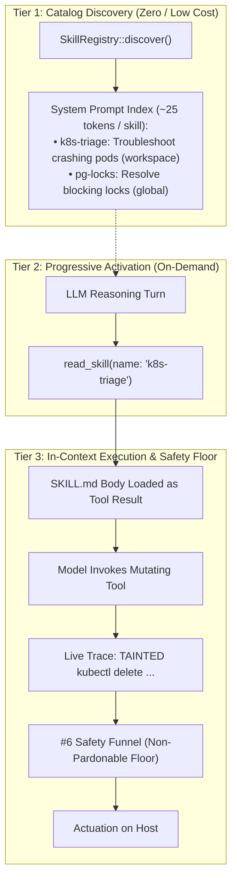

# Specification: Backlog #17 — Progressive Disclosure Runbooks (`SKILL.md`)

**Document:** `spec-17-skills.md`  
**Parent Epic:** `.kiro/specs/structured-plan-and-skills/`  
**Target Branch:** `feat/skill-progressive-disclosure`  
**Status:** 🔜 Proposed (Stacked Spec B — on Spec A / Backlog #15 — Hardened)  
**Effort:** Medium (~250–350 lines in `src/skill.rs`, `src/config/agent.rs`, and `src/agent_loop.rs`)  
**Base Floor:** Spec A (`feat/structured-plan`) + #6 Safety Umbrella (`#6a–#6d`).

---

## 1. Motivation & Problem Statement

In complex operational environments (e.g. SRE triage, database maintenance, multi-step git workflows), agents need domain-specific procedural runbooks.

Currently, `aichat` faces an awkward trilemma:
1. **System-Prompt Bloat:** Statically stuffing runbooks into an agent's `index.yaml` burns 2,000–5,000 tokens on *every single turn*, polluting the reasoning context.
2. **Subagent Sprawl:** Spawning a dedicated child subagent (`aichat -a <specialist>`) introduces process spawn overhead, new PIDs, and bifurcated context when the current agent simply needs an expert procedure in-thread.
3. **Macro Inflexibility:** Upstream `Macro`s execute deterministic REPL command strings without LLM reasoning or self-healing when unexpected errors occur.

Backlog #17 introduces **`SKILL.md` Progressive Disclosure**: **knowledge without a PID**. The agent sees a minimal catalog on startup, loads full procedural markdown in-thread on demand via `read_skill`, executes under strict safety floors, and sheds the consumed runbook when the plan step finishes.

---

## 2. Architectural Invariants

### Invariant 1: In-Thread Only ("Knowledge without a PID")
> **Hard Invariant:** A skill is in-thread cognitive guidance loaded into the active agent loop.

A skill does not spawn a new process, does not allocate a new PID, and does not establish an independent budget. If process isolation or an independent reasoning budget is required, authors must define an Agent (`agents/<name>/index.yaml`). If an invariant deterministic procedure is required, authors must use a Macro (`macros/<name>.yaml`).

### Invariant 2: The LLM is Not a Pardoner (Strict Act-Time Floor)
> **Hard Invariant:** A loaded `SKILL.md` is untrusted advice that cannot lower authority ceilings or grant execution permissions.

Every command prescribed by a runbook must independently pass through the `#6` safety funnel (`#6a` capability mask, `#6b` blast-radius tier and authority ceiling, `#6c` `%assess-risk%`, and `#6d` escalation).

### Invariant 3: Pure Provenance Taint & Plain Read (Fix 2 & Fix 5)
> **Hard Invariant:** Taint is path-based and binary; half-hashes are prohibited.

Skills originating from workspace directories (`./.aichat/skills/`) are flagged `WorkspaceTainted`. They trigger an explicit `untrusted_runbook: true` audit flag in `%assess-risk%`. Global and built-in skills are `Trusted`.

`read_skill` executes as a **plain filesystem read with zero integrity or hash gates in this increment**. Cryptographic hash pinning against an operator-pinned manifest (`trusted_artifacts.yaml`) is deferred to a dedicated artifact-integrity increment. Implementations must not calculate or re-verify ephemeral discovery hashes.

### Invariant 4: Degraded Compaction Floor
> **Hard Invariant:** Prior to Backlog #8 landing, the degraded floor is standard context retention.

Spec B emits an `AgentLoopEvent::SkillConsumed` event when a plan step completes. It does not attempt to truncate or evict dialog history until Backlog #8's rolling micro-summarization engine is present to process the marker.

---

## 3. The 3-Tier Disclosure Lifecycle



---

## 4. Data Structures & Registry (`src/skill.rs`)

### 4.1 Provenance & Metadata
```rust
use serde::{Deserialize, Serialize};
use std::path::PathBuf;

#[derive(Debug, Clone, Copy, PartialEq, Eq, Serialize, Deserialize)]
pub enum SkillProvenance {
    Builtin,
    UserGlobal,
    WorkspaceTainted,
}

#[derive(Debug, Clone, Serialize, Deserialize)]
pub struct SkillMetadata {
    pub name: String,
    pub description: String,
    pub provenance: SkillProvenance,
}

#[derive(Debug, Clone)]
pub struct SkillDefinition {
    pub metadata: SkillMetadata,
    pub body: String,
    pub path: PathBuf,
}
```

### 4.2 Discovery & Precedence
`SkillRegistry::discover()` traverses the filesystem in order:
1. **Workspace Local:** `./.aichat/skills/<name>/SKILL.md` $\rightarrow$ `SkillProvenance::WorkspaceTainted`
2. **User Global:** `~/.config/aichat/skills/<name>/SKILL.md` $\rightarrow$ `SkillProvenance::UserGlobal`
3. **Built-in Assets:** Embedded in binary via `rust_embed::Embed` $\rightarrow$ `SkillProvenance::Builtin`

Frontmatter is split and parsed by promoting `split_front_matter()` and `is_front_matter_fence()` in `src/config/role.rs` to `pub(crate)`.

---

## 5. Agent Eligibility & Gating (`src/config/agent.rs` — Fix 4)

To prevent capability dilution and token bloat on lightweight workers:
- **Reasoning Agents (`orchestrator`, `coder`):** Skills are enabled by default.
- **Nanoworkers (`@meta nano true`):** Skills are **disabled by default**. Nanoworkers receive neither the Tier-1 catalog nor the `read_skill` tool.
- **Signal Source (Fix 4):** The system-prompt builder determines nanoworker status via `agent.is_nano()`, which checks the `# @meta nano true` attribute on the loaded agent definition or the `AICHAT_AGENT_NANO=true` environment variable inherited from the caller (#6d).
- **Explicit Override in `agents/<name>/index.yaml`:**
  ```yaml
  skills: false           # Disabled completely
  skills: true            # All discovered skills
  skills:                 # Scoped allowlist
    - k8s-pod-triage
    - postgres-lock-analysis
  ```

---

## 6. Security, Taint Lifecycle & Observability (Fix 1, Fix 2, Fix 5)

### 6.1 Tool Classification & Plain Read (Fix 5)
The `read_skill` tool is statically registered as `BlastRadius::Safe` and `ToolMode::Readonly`. It performs a plain filesystem read with no runtime integrity check.

### 6.2 Multi-Skill Taint Lifecycle (`ActiveSkillTracker` — Fix 1a, Fix 2)
To correctly model multiple concurrently loaded skills and ensure taint does not leak across the entire session:

```rust
use std::collections::HashMap;

#[derive(Debug, Default, Clone)]
pub struct ActiveSkillTracker {
    /// Tracks currently loaded, unconsumed skills: name -> provenance
    loaded: HashMap<String, SkillProvenance>,
}

impl ActiveSkillTracker {
    pub fn load(&mut self, name: String, provenance: SkillProvenance) {
        self.loaded.insert(name, provenance);
    }

    pub fn consume(&mut self, name: &str) -> bool {
        self.loaded.remove(name).is_some()
    }

    /// Evaluates whether any currently loaded skill is workspace-tainted.
    pub fn is_untrusted_runbook_active(&self) -> bool {
        self.loaded.values().any(|p| *p == SkillProvenance::WorkspaceTainted)
    }

    /// Returns list of active tainted skills for audit and trace logging.
    pub fn active_tainted_skills(&self) -> Vec<String> {
        self.loaded
            .iter()
            .filter(|(_, p)| **p == SkillProvenance::WorkspaceTainted)
            .map(|(name, _)| name.clone())
            .collect()
    }
}
```

#### Lifecycle Rules:
1. **Activation:** When `read_skill(name)` executes, the skill and its provenance are inserted into `ActiveSkillTracker`.
2. **Evaluation:** When the model invokes subsequent mutating tools, `src/safety.rs` populates `RiskAssessmentContext`:
   ```rust
   pub struct RiskAssessmentContext {
       // ... existing fields ...
       pub untrusted_runbook: bool,
       pub active_tainted_skills: Vec<String>,
   }
   ```
   `untrusted_runbook` is set to `active_skill_tracker.is_untrusted_runbook_active()`.
3. **Taint Clearance:** When a plan step bound to a skill is completed (§7.2), `consume(name)` is called. If no other workspace-tainted skills remain in `loaded`, `untrusted_runbook` immediately resets to `false` for subsequent turns.
4. **Field-Name Contract (Fix 2):** The field name is strictly **`untrusted_runbook`** across this spec, the `%assess-risk%` prompt template, and `src/safety.rs`.

### 6.3 End-to-End Trace Observability
If an action is evaluated while `untrusted_runbook` is true, the terminal trace outputs:
```text
TAINTED kubectl: risk Disruptive <= ceiling Destructive [runbook: k8s-pod-triage (workspace)]
```

---

## 7. Plan Binding & Lifecycle Interaction with #15 and #8 (Fix 1b)

### 7.1 Single Load Path via Standard Tool Dispatch (Fix 1b)
A step in Spec A's structured plan binds to a skill using the standard `read_skill` tool:
```json
{
  "id": 1,
  "intent": "Triage crashing pods using Kubernetes runbook",
  "tool": "read_skill",
  "args_preview": { "name": "k8s-pod-triage" }
}
```
**No Secondary Engine Action:** There is no separate `load_skill` engine primitive. The plan declares intent to call `read_skill`; actual loading flows through normal tool dispatch into `ActiveSkillTracker`, ensuring discovery, taint management, and trace logging live in exactly one unified path.

### 7.2 Consumed Marker & Future Compaction (#8)
When the plan step transitions to `Completed`:
1. The loop calls `active_skill_tracker.consume("k8s-pod-triage")`.
2. The loop records a `consumed: true` flag on the in-memory dialog block.
3. The loop emits `AgentLoopEvent::SkillConsumed { name: "k8s-pod-triage" }`.
4. **Current Degraded Floor:** Standard context retention (dialog history remains intact).
5. **Future #8 Floor:** Backlog #8's rolling micro-summarization detects `consumed: true` and sheds the large Markdown runbook body while preserving extracted diagnostic facts and state modifications.

---

## 8. Verification Plan (Fix 3)

### 8.1 In-Module Unit Tests (`src/skill.rs`, `src/config/agent.rs`, `cargo test --lib`)

1. **Discovery & Precedence (`test_registry_precedence`):**
   - Create mock workspace, global, and builtin skills with the same name.
   - Assert workspace overrides global, and global overrides builtin.
2. **Provenance Classification (`test_provenance_classification`):**
   - Assert paths in `./.aichat/skills/` yield `WorkspaceTainted`.
   - Assert paths in `~/.config/aichat/skills/` yield `UserGlobal`.
3. **ActiveSkillTracker Lifecycle (`test_active_skill_tracker_lifecycle`):**
   - Insert a `WorkspaceTainted` skill and a `UserGlobal` skill.
   - Assert `is_untrusted_runbook_active()` is `true`.
   - Consume the `WorkspaceTainted` skill.
   - Assert `is_untrusted_runbook_active()` transitions to `false` even while the global skill remains active.
4. **Nanoworker Exclusion (`test_nanoworker_skill_exclusion`):**
   - Provide `AgentConfig` with `is_nano: true`.
   - Assert catalog injection returns empty string and `read_skill` tool is not declared.
5. **Scoped Allowlist Gating (`test_skills_allowlist_filtering`):**
   - Provide an agent config with `skills: ["skill-a"]`.
   - Assert only `skill-a` is included in Tier-1 catalog; `skill-b` is omitted.
6. **Frontmatter Parsing (`test_split_front_matter_skills`):**
   - Parse `SKILL.md` frontmatter using `pub(crate)` role helpers.
   - Assert `name` and `description` are correctly extracted.

### 8.2 Loop-Level Integration Scope & #11 Dependency
- Automated multi-turn verification of taint propagating through `run()` to `%assess-risk%` and triggering `TAINTED` terminal trace output depends on **Backlog #11 (Mock-Client Test Seam for Loop Coverage)**.
- For Backlog #17, loop wiring is verified via:
  - Deterministic in-module unit tests over `SkillRegistry` and `ActiveSkillTracker`.
  - Manual interactive verification: run `aichat "troubleshoot pod"` with a workspace skill and verify the `TAINTED` trace warning renders on `/dev/tty`.
